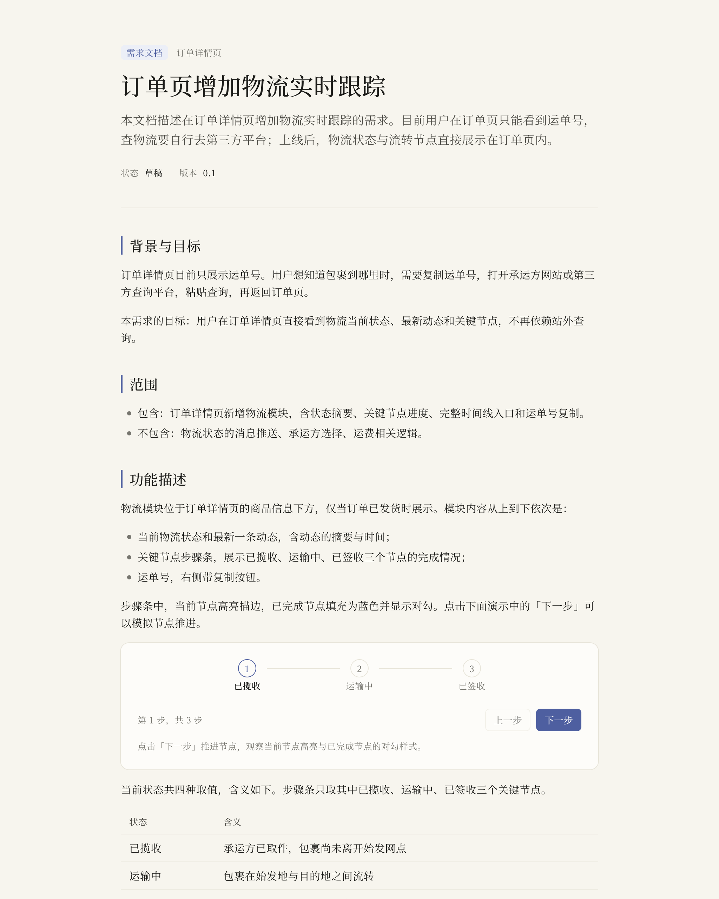
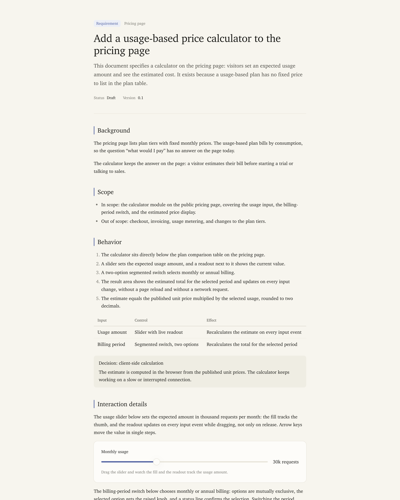
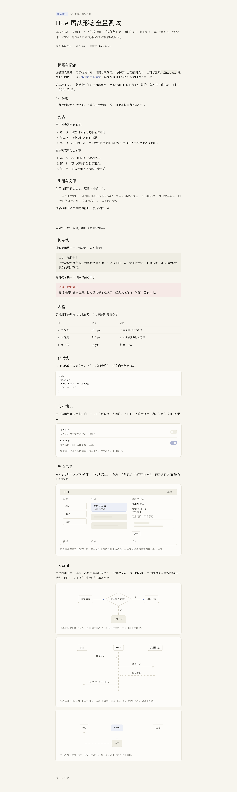
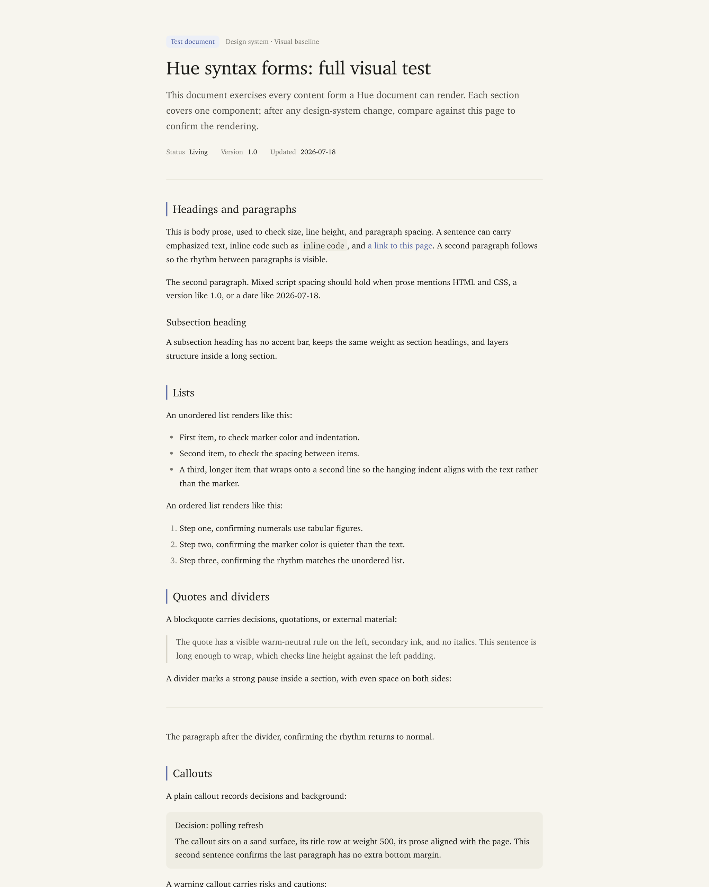

<p align="center">
  
</p>

<h1 align="center">Hue</h1>

<p align="center">Requirement documents people actually read.</p>

Hue is an agent skill that turns a natural-language description into a single,
self-contained HTML requirement document: a clear title, structured prose, and
interactive demos embedded anywhere in the reading flow, all in one quiet,
hydrangea-tinged design language. Named after the hydrangea: one plant,
many hues; one design system, many documents.

## What you get

- **One file, fully self-contained.** All CSS and JS inlined; no fonts, CDNs, or
  network requests. Open it, share it, archive it.
- **A real design system, not generated styling.** Warm paper canvas, serif-led
  typography (Chinese and English stacks), one hydrangea-blue accent, tokenized
  spacing and motion. The AI fills a template; it never writes CSS.
- **Sixteen demo blocks.** Buttons, forms, toggles, sliders, tabs, dialogs,
  toasts, steppers, skeletons, spring-motion comparisons, static wireframe
  schematics, static relationship diagrams (flow, sequence, and state) and
  more — each a self-contained block that matches the page and can be placed
  anywhere.
- **Bilingual by design.** Chinese and English documents each get their own font
  stack, letter-spacing, punctuation rules, and prose-quality gate.

## Examples

Documents generated by Hue, kept in [`examples/`](examples/) as the visual
baseline — open the HTML files to try the interactive demos.

**Requirement documents** — [zh](examples/requirement-zh.html) · [en](examples/requirement-en.html)

<p align="center">
  
  
</p>

**Syntax showcase** — every content form a Hue document can render, [zh](examples/syntax-zh.html) · [en](examples/syntax-en.html)

<p align="center">
  
  
</p>

## Install

```bash
npx skills add iCyris/Hue -a universal -g -y
```

Any host that reads a root-level `SKILL.md` (agentskills-compatible loaders)
picks it up from there.

## Use

Describe the requirement; ask for a Hue document:

```
/hue Write a requirement doc for adding real-time shipment tracking to the
order page, with a stepper demo.
```

Hue fills `templates/document.html`, embeds demo blocks from `templates/demos/`
(translating their strings into the document language), runs the quality gate,
and hands you one `.html` file.

## Quality gate

```bash
bash scripts/check.sh --lang auto your-document.html
```

Checks structure, self-containment, design-token discipline, per-language
punctuation and spacing, and the demo block contract. A document does not ship
until it prints `check: ok`.

## Repository layout

- `SKILL.md` — agent entrypoint: contract, workflow, language routing
- `references/` — design system, demo contract, per-language writing rules
- `templates/` — `document.html` plus the sixteen demo blocks
- `scripts/` — the stdlib-only quality gate
- `examples/` — generated documents kept as the visual baseline

Typography and editorial discipline are informed by
[Kami](https://github.com/tw93/Kami); skill conventions by
[Waza](https://github.com/tw93/Waza).

## License

Hue is [MIT-licensed](LICENSE) © 2026 Cyris — free to use, modify, and
distribute in personal or commercial projects. Attribution is appreciated but
not required by the license terms.
